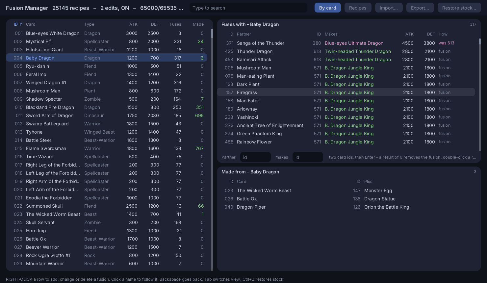
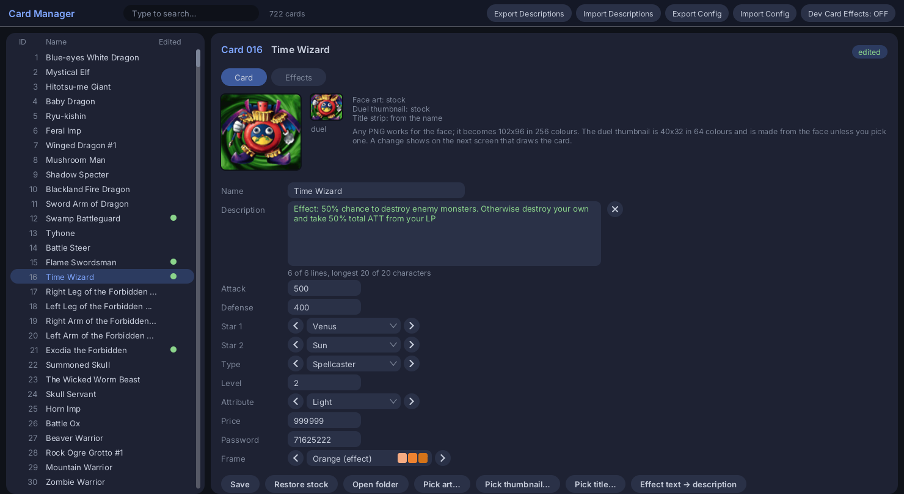
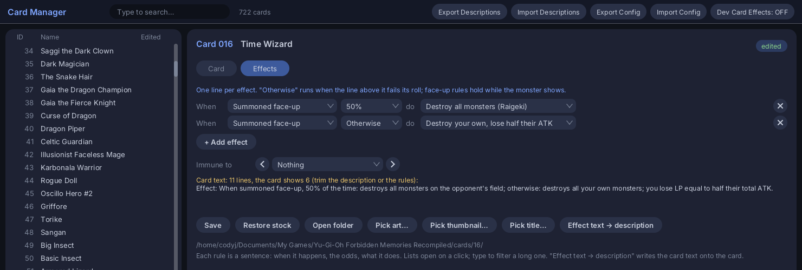

# Yu-Gi-Oh! Forbidden Memories — Recompiled

A static recompilation of **Yu-Gi-Oh! Forbidden Memories** (USA, SLUS-01411).
The game's MIPS code is translated to C ahead of time and compiled into a native
executable — it is not interpreted by an emulator.


*A duel running natively. The menu bar and the duel-rank meter beside the FIELD
box are this project's, drawn in the game's own art.*

On top sits a set of quality-of-life features: a live duel-rank meter, a fusion
assistant, a card-drop multiplier, managers for the drop tables, the cards and
every fusion in the game, and a cheat menu — all toggleable at runtime.

Built on [PSXRecomp](https://github.com/mstan/psxrecomp).

> **You bring your own disc.** Nothing in this repository, and nothing in the
> download, contains any of the game's code or data — the screenshot above is
> just that, a screenshot. The C is generated on your machine, from your copy,
> the first time you run it.

| | |
|---|---|
| Serial | SLUS-01411 (USA / NTSC-U) |
| Players | 2 |
| Publisher | Konami, 1999 |
| BIOS | OpenBIOS, bundled — nothing to supply |

---

## What this adds

Everything below lives in the overlay menu on **`F10`**, and every setting takes
effect immediately — no restart, no patched save.

### ⚔️ Duel rank meter — `VIEW → DUEL RANK`

The game grades every duel you win but only tells you afterwards. This puts the
grade on screen **while you play**, in the game's own HUD sprites.

| Mode | What you get |
|---|---|
| `OFF` | stock behaviour |
| `IN GAME` | the game's POW/TEC badge and rank letter, beside the FIELD box |
| `IN GAME + SCORE` | the same, plus the raw 0–99 score |
| `OVERLAY TEXT` | plain text in the corner — never covered by a card view |

### 🧩 Fusion assistant — `VIEW → FUSION HINT`

Forbidden Memories has thousands of fusions and teaches you none of them. This
reads your hand against the game's real tables in memory, not a copied list, so
its answers are the game's answers.

| Mode | What you get |
|---|---|
| `OFF` | stock behaviour |
| `NUMBERS` | pick order marked on the cards themselves |
| `NUMBERS + INFO` | pick order plus the name of the card it produces |

`VIEW → SUGGEST FUSION BY` chooses **ATTACK** or **DEFENSE**.

### 🔮 Fusion Manager — `VIEW → FUSION MANAGER`

> ⚠️ **Experimental — expect bugs.** Much newer than the rest of this list. It
> cannot hurt your save: every change is a file beside your saves, and `Restore
> stock` undoes the lot.

The assistant above answers "what can this hand make?" mid-duel. This answers
the other question — **every fusion in the game, both ways round** — and lets
you change any of them.



**Fuses with** is every partner and what the pair makes, equips included with
their +500 / +1000 already in the numbers; **Made from** is every pair that
makes it. Click a name to follow it, `Backspace` to go back. `Recipes` is all
25 146 as one sortable list.

**Right-click a row** to change, delete or add a fusion, picking the card off a
searchable list — type `dragon`, take *Blue-eyes Ultimate Dragon*, never having
to know it is card 380. `Delete all…` empties the table for designing a set from
scratch; `Restore stock…` (or `Ctrl+Z`) puts the game's own back, keeping a copy
in `fusion_edits_backup.txt`. `Export…` / `Import…` move a recipe list as plain
text (a `card1,card2,result` CSV works), and changes save to `fusion_edits.txt`
as you make them.

**MODS → FUSION EDITS** replaces the fusion table's **disc sectors**, so the
game's own loader brings your table in and everything reads it, the AI planners
included; a duel already running is patched in memory too. The table is read off
the disc rather than duel RAM, so the window works from boot with no duel — and
it shows the fifteen *glitch fusions* the packed format produces by accident and
the game really performs. The format holds 65 535 bytes and stock uses 65 002,
so there is room for about a hundred new recipes; an edit that would not fit is
refused.

### 🎴 Card drops — `MODS → CARD DROPS`

Stock, a won duel awards exactly one card. This makes it **1–99**. It comes with
a results screen stock never had: the cards you won across three pages you flip
with **D-pad Left/Right**, with the game's own yellow **New!** tag on anything
you didn't already own.

### 🃏 Drop missing cards — `MODS → DROP MISSING CARDS`

**82 of the game's 722 cards are dropped by nobody** — both of Exodia's legs
among them, which is why the set cannot be completed in the stock game. This
gives every one a source by rewriting the weights the duel loads into memory;
your disc is untouched. Placement is yours, in **`drop_missing_cards.ini`**:

```ini
[Weevil Underwood]
52  =  30,  20,   0   ; Hercules Beetle
278 =  30,  20,   0   ; Petit Moth
```

The three numbers are the S/A POW, B/C/D and S/A TEC rates, out of 2048 — 20 is
about 1%. Each band totals 2048, so what you add comes off that duelist's normal
drops in proportion. Delete the file for the defaults back.

### 🗂️ Drop Table Manager — `VIEW → DROP TABLE MANAGER`


A **separate window** you can leave open on another monitor while you play. It
knows every card and every duelist's drop table — and **you can rewrite any
duelist's drops and the game rolls what you wrote.**

| View | What you get |
|---|---|
| `By card` | all 722 cards — id, name, type, ATK, DEF, how many tables drop it — sortable on any column, with every duelist that drops the selected one, the rank band needed, and the chance |
| `By duelist` | all 39 duelists, with everything they drop, the band, and the weight both raw and as a percentage |

Type to search, click a heading to sort, click a row on the right to cross into
the other view. Weights are out of 2048, which is what lets one read as a
percentage.

**Editing.** Click a weight and type a new one; click the rank cell to move a
drop between bands; right-click for add, move and remove; or **drag a card from
the left list onto a duelist**. Every band still totals exactly 2048, so what
you add comes off that duelist's other drops in proportion, and an edit that
cannot balance is refused rather than fudged.

**Nothing is written until `Save`**, which persists your table as
`drop_table_edits.ini` (hand-editable); `Defaults` clears a duelist back to
stock. `Load… → Export the current table` writes a file in `drop_tables/` to
send to someone. With `DROP MISSING CARDS` on, the manager shows and edits the
table you will actually roll against.

Card names and ATK/DEF come from the running game; the drop tables are baked
from your disc when you build. Duelist portraits are Konami art and, like
everything here, **never shipped** — the manager reads them off your own disc.

### 🎨 Card Manager — `VIEW → CARD MANAGER`

> ⚠️ **Experimental — expect bugs.** Much newer than the rest of this list. It
> cannot hurt your save: edits live in `cards/`, and `Restore stock` puts a card
> back.

Change any of the 722 cards: **name, description, face art, duel thumbnail, ATK,
DEF, both Guardian Stars, type, level, attribute, price and password**. The
change shows up **everywhere the card is drawn**, because it is applied where
the game reads, not where it draws.



Green marks your edit and the `x` puts it back; the frame row is why an effect
monster comes out orange.

An edited card is a folder in your player-data:

```
cards/<id>/card.ini     name = Blue-eyes Ultimate Dragon
                        color = purple       (yellow, green, pink, blue, purple, orange)
                        description = Text with|a line break   (| = new line; no | = wrapped at 20)
                        attack = 4500        defense = 3800
                        star1 = Sun          star2 = Mars
                        type = Dragon        level = 12      attribute = Light
                        price = 999999       password = 12345678
cards/<id>/art.png      any size — becomes the 102x96 / 256-colour card face
cards/<id>/thumb.png    optional; the 40x32 / 64-colour duel card, made from art.png when absent
cards/<id>/title.png    optional 96x14 title strip; rendered from `name` when absent
```

Every key is optional and a missing one keeps the stock value. **Folders are
watched**: edit a file or drop a new folder in and the game picks it up within
seconds. Nothing on your disc or in your save is touched — the mod serves
replacement disc sectors and table entries to the running game, and removing the
folder restores stock. Titles are rasterised in the game's own style when a
`timesbd.ttf` sits in `cards/`.

#### Effects

The same `card.ini` carries what a card **does**:

```
effect = damage            what a Magic card does when played (see the list)
amount = 2000              its number: LP healed or lost, the ATK threshold,
                           or how much the opponent's monsters lose
target = Dragon            for effect = destroy_type
terrain = Yami             for effect = field
ritual = 58, 58, 58 -> 26  for effect = ritual: three materials on your field -> result
equip_bonus = 1500         an Equip card's ATK/DEF bonus (stock 500, Megamorph 1000)
equips = Dragon, Warrior, 5, 12   the monsters it fits: types, card ids, all or none
                           (this REPLACES the stock list; leave it out to keep it)
boost = Dragon +1000, Fairy -500  a field card (Forest..Yami): each type's boost
trap_atk_max = 3000        a trap (House of Adhesive Tape..Widespread Ruin):
                           attackers at or under this ATK are stopped
```

Effects a Magic card can take: `none`, `heal`, `damage`, `destroy_type`,
`destroy_atk`, `raigeki`, `dark_hole`, `dragon_jar`, `stop_defense`, `flip`,
`weaken` (a negative amount strengthens), `swords`, `cursebreaker`, `harpie`,
`field`, `ritual` — any Magic or Ritual card can take any of them, and the
game's own handler runs with your number. Equip compatibility, ritual recipes,
field boosts and trap ceilings are the game's own tables, served edited. What
stays fixed is what is code rather than data: which cards count as traps (only
681–686), the four scripted traps, and the granularity of heal and damage.

#### Monster effects

Stock monsters do nothing but fight. The **Effects** tab shows a monster's rules
as sentences — here is Time Wizard with the one it has in every other game:



Two lines and it is done. `+ Add effect` adds one, the `x` removes it, every
list filters as you type, and `Effect text → description` writes the generated
card text onto the card. The same rules in `card.ini`:

```
battle    = indestructible | mutual | slayer     how it fights
on_summon = damage 1000     when it lands face-up      on_flip / on_death /
on_attack = heal 500        when it attacks            each_turn / opp_turn too
on_summon = 50%: raigeki; else: destroy_own_lp   branches, each rolling its odds
bonus     = 500, 200 per ally, 500 per Lava Battleguard, 300 per hand
immune    = traps, magic
```

A face-down monster has no effect until it is turned over. The cast effects are
the Magic list above plus `gamble` (Time Wizard's coin) and `destroy_own` /
`destroy_own_lp`; they run through the game's own effect engine, with the popup
and sound the matching spell would show. A monster with any of these draws with
the orange effect frame unless `color` says otherwise.

#### The Card Effects mod

`MODS → Card effects` (or `Dev Card Effects` in the manager) switches to a
second card set in `mods/card_effects/cards/`: the original cards with their
real effects adapted to Forbidden Memories. While it is on, the manager, Export
and Import work on that set and your own `cards/` edits sit untouched. Off by
default.

#### Sharing and bulk edits

`Export Config` writes every edited card — `card.ini` and PNGs — plus your
`drop_table_edits.ini` to a single `.ygocards` file (a plain zip); `Import
Config` shows what it holds and what it would replace before replacing it.

`Export Descriptions` writes all 722 names and descriptions to one text file,
one block per card:

```
[3] Hitotsu-me Giant
A one-eyed behemoth
with thick, powerful
arms made for
delivering punishing
blows.
```

Edit it in any editor (a card shows six lines of twenty characters) and `Import
Descriptions` reads it back: only the cards that differ are written. It shows
live.

### 💬 Dialogue Manager — `VIEW → DIALOGUE MANAGER`

> ⚠️ **Experimental — expect bugs.** Much newer than the rest of this list. It
> cannot hurt your save: translations live in `dialogue/`, and `Back to
> original` removes them.

For translations: the campaign's dialogue (150 texts) exports to one plain text
file and a translated file imports back at runtime, without touching the disc.
The window lists them with a search box, original beside current. The file is
just words:

```
[1923]
Hmmm...
T'would seem I've won.

Many days have passed since
I taught you the game...
But you've still much to learn.
```

A blank line is a page break, and nobody has to count characters: on import,
long lines are wrapped and long pages split. The game's own codes show as `{1}`,
`{2}`… and only need to stay in order next to the same words; `{name}` is the
player's name. An imported file lives on as `dialogue/dialogue.txt`, and one
that fails to parse changes nothing.

### 🛒 Card shop — `MODS → CARD SHOP`


The card shop has never sold a card. This makes it one: the shopkeeper's menu
grows a fifth row that **buys card packs** with your starchips.

Four pack types — monster, magic, equip, trap — across four rarities, priced
20 / 80 / 200 / 800, with **all 722 cards in the pool**. A pack deals its cards
one at a time: **X** turns over the next slot, **TRIANGLE** opens the game's own
card viewer. Bought cards land in your trunk marked **New!**, like a duel drop.

Prices, bands and where individual cards sit are yours — the shop writes
**`card_shop.ini`** next to your saves and re-reads it each time you leave the
shop and come back:

```ini
[prices]
legendary = 800

[packs]
cards = 3          ; 1-3, the results box prints three

[monster]
legendary_atk = 2500   ; a monster lands in the highest band its ATK reaches

[cards]
Exodia the Forbidden One = legendary   ; or `rare+legendary` for both
```

### 🖥️ Widescreen — `VIEW → WIDESCREEN` *(experimental)*

16:9, contributed by [yamyi](https://github.com/Unchiga/YuGiOhForbiddenMemoriesRecomp/pull/1).
The duel field renders genuinely wider; flat 2D screens stay 4:3 and are
pillarboxed rather than stretched. Experimental: culling pop-in at the wide
edges has not been fully checked for this title.

### 💰 Cheats — `CHEATS`

| Row | Range | Notes |
|---|---|---|
| `LIFE POINTS` | 1–9999 | 8000 is stock. Applies to both duellists |
| `SHOW OPPONENT HAND` | on / off | their hand is drawn face-up, like yours |
| `FORCE FACE UP` | on / off | their set cards play face-up — and stay face-up |
| `STARCHIPS` | 0–999999 | written straight to your save |
| `FREE SPENDING` | on / off | purchases succeed, the deduction is undone |
| `ALL CARDS` | 1, 2 or 3 of each | fills the trunk. Apply with the chest closed |

Neither reveal is an overlay: they clear the actual flags, so a monster revealed
face-up genuinely is face-up and will not flip when attacked. The first three
rows are preferences restored on every launch; the other three write live save
data, so they are not re-applied at startup and decline until a save is loaded.

### From the runtime

Also in the `F10` menu, courtesy of PSXRecomp: save states, rewind (`F8`), an
emulation-speed multiplier, and **`GAME → FAST LOADING`**, which cuts disc loads
to near-instant. That one ships **off**.

---

## Controls

### Controller

**Xbox controllers work out of the box** — plug one in, no setup. So do PS4 and
PS5 pads (rumble on DualSense) and Steam Input. The game is a PS1 title, so it
starts in **digital** pad mode and the sticks map to the d-pad.

> Very old DirectInput-only pads are the exception. DirectInput is off by
> default because enumerating it stalled startup by up to 40 seconds on some
> machines. Set `SDL_JOYSTICK_DIRECTINPUT=1` to bring it back.

### Keyboard

| PlayStation | Key | | PlayStation | Key |
|---|---|---|---|---|
| D-pad | Arrow keys | | L1 | `Q` |
| ✕ Cross | `X` | | R1 | `W` |
| ○ Circle | `S` | | L2 | `E` |
| □ Square | `Z` | | R2 | `R` |
| △ Triangle | `A` | | L3 / R3 | `T` / `Y` |
| Start | `Enter` | | Select | `Right Shift` |

Mostly you need **arrows** to move, **`X`** to confirm, **`S`** to cancel.

### Hotkeys

| Key | Does |
|---|---|
| `F10` | Open the overlay menu — every feature on this page lives there |
| `F7` | Save / load state |
| `F8` | Rewind |
| `Tab` | Turbo (hold) |
| `Alt`+`Enter` or `Ctrl`+`F` | Fullscreen |
| `F` | Show performance stats |
| Numpad `+` / `-` | Volume |

Keys live in `keybinds.ini` next to the executable, with the accepted names at
the top. Each input takes a second binding after a comma: `cross = X, Mouse1`.

---

## First run

The download is a **setup host** — a small executable plus the recompiler and
the framework source. It has no game code in it until you supply a disc.

1. Run `Yu_Gi_Oh_Forbidden_Memories_Recompiled.exe`.
2. It asks for your disc image and checks it against the CRC32 this build
   expects. A mismatch is **refused**, naming the release it needs.
3. It downloads a compiler if you have none, translates the game to C from your
   copy, and compiles it.
4. It builds into `build-release/` and starts the game.

Nothing needs installing first — the setup brings its own compiler and Python,
and uses yours if you already have them.

> ### ⏳ The first run takes a few minutes — let it finish
>
> A compiler download, a whole game translated to C and a real compile happen
> before you see anything; the console working away is not hanging. **Every run
> after the first starts immediately.**

### Which dump

`.cue` is preferred, with its `.bin` beside it; `.bin`, `.img`, `.iso` and
`.car` also work.

This build is compiled from the USA release, serial **SLUS-01411** — a PAL,
Japanese or Greatest Hits disc is a different program and cannot run here. The
expected data-track CRC32 is recorded in `game.toml` as `disc_crc`. To repoint
it, use `FILE → CHANGE GAME DISC`.

### Command line

Scripted and headless runs have no picker and must be told:

```bash
Yu_Gi_Oh_Forbidden_Memories_Recompiled.exe --disc "/path/to/game.cue"
```

Also available: `--memcard-dir <path>`, `--no-launcher`.

---

## Building from source

The framework is a submodule at `psxrecomp/`, so clone recursively:

```bash
git clone --recurse-submodules https://github.com/Unchiga/YuGiOhForbiddenMemoriesRecomp.git
```

`generate` produces **both** the recompiled BIOS and the game's C — a fresh
clone has no BIOS backend until this runs:

```bash
python3 psxrecomp/psxrecomp_cli.py generate \
  --config game.toml --project-root . --disc /path/to/your.cue
cmake -S . -B build -G Ninja -DCMAKE_BUILD_TYPE=Release
cmake --build build --target psx-runtime
```

(The setup host does exactly this for you — see [First run](#first-run).)

`generated/` and the baked sprite and font sources come from **your** disc; they
are gitignored and must not be published — see [NOTICE](NOTICE). CMake must know
where your disc is: running `generate` first is enough, failing that
`-DYGOFM_DISC=<path>`.

### macOS

Builds and runs natively on Apple Silicon with the commands above. Needs the
Xcode Command Line Tools plus `brew install cmake ninja pkg-config sdl3`. Use
`-j4` on an 8 GB machine — the generated C includes shards of 400k+ lines.

Add `-DPSX_DEBUG_TOOLS=ON` for a debug build with the TCP inspection server on
`127.0.0.1:4370`.

### Packaging a release

```bash
cmake -S psxrecomp/recompiler -B build-recompiler -G Ninja -DCMAKE_BUILD_TYPE=Release
cmake --build build-recompiler --target psxrecomp-game psxrecomp-bios
cmake -S . -B build-setup -G Ninja -DCMAKE_BUILD_TYPE=Release -DPSXRECOMP_FORCE_SETUP_HOST=ON
cmake --build build-setup --target psx-runtime
scripts/package_setup_release.sh build-setup <artifact-tag>
```

Writes `dist/ygofm-<version>-<tag>.zip`. Needs `objdump` on `PATH`, and the
build directory must be a **setup host** build, not the game.

---

## Framework and symbols

`psxrecomp/` is pinned to the
[`ygofm`](https://github.com/Unchiga/psxrecomp/tree/ygofm) branch of a fork of
[PSXRecomp](https://github.com/mstan/psxrecomp), for framework work not upstream
yet: the disc-identity gate, registration APIs so a title owns its own debug
commands and overlays, the hooks the manager windows run on, and a
launcher-less setup host. All additive and intended for upstream.

Symbols: `symbols.toml` → `python3 tools/sync_symbols.py` → `psx_symbols.h`
(`PSX_FN_*`). See `psxrecomp/docs/SYMBOLS.md`.

---

## Licence and legal

PolyForm Noncommercial License 1.0.0 — see [LICENSE](LICENSE). Noncommercial use
only, and it cannot be sublicensed or swapped for a permissive one, because the
framework it builds on is offered on the same terms (Copyright © 2026 Matthew
Stan). It grants nothing in respect of the game, which is Konami's — use only a
disc image you obtained legally.

Read [NOTICE](NOTICE) before redistributing anything — particularly before
sharing a *compiled build*, which is not the same as sharing this repository.

## How to Help

Join our newly created Discord, https://discord.gg/SR8qWG9Ve
